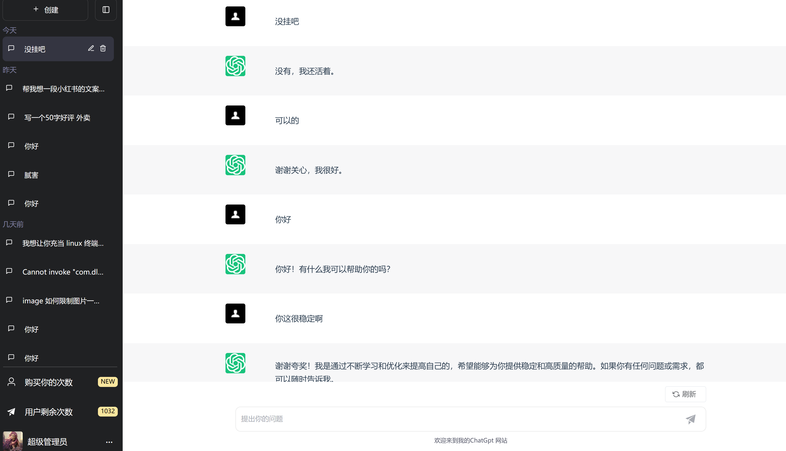

# 搭建属于自己的chatgpt镜像网站

网站体验地址：https://error.cool/gpt/#/gpt

本项目目前只开源前端 还在更新中 欢迎兄弟们体验 任何问题都可向我提问

需要源码的可以联系作者微信：**DLY1181434433**

技术栈：

​	后端：java17 + springboot3.0 + postgresql + mybatisplus + minio + mongodb + redis等 

​	前端：ts + vue3 + pinia 等

​	项目构建：前端vite  后端gradle

展示图片：

pc端：

手机端：

